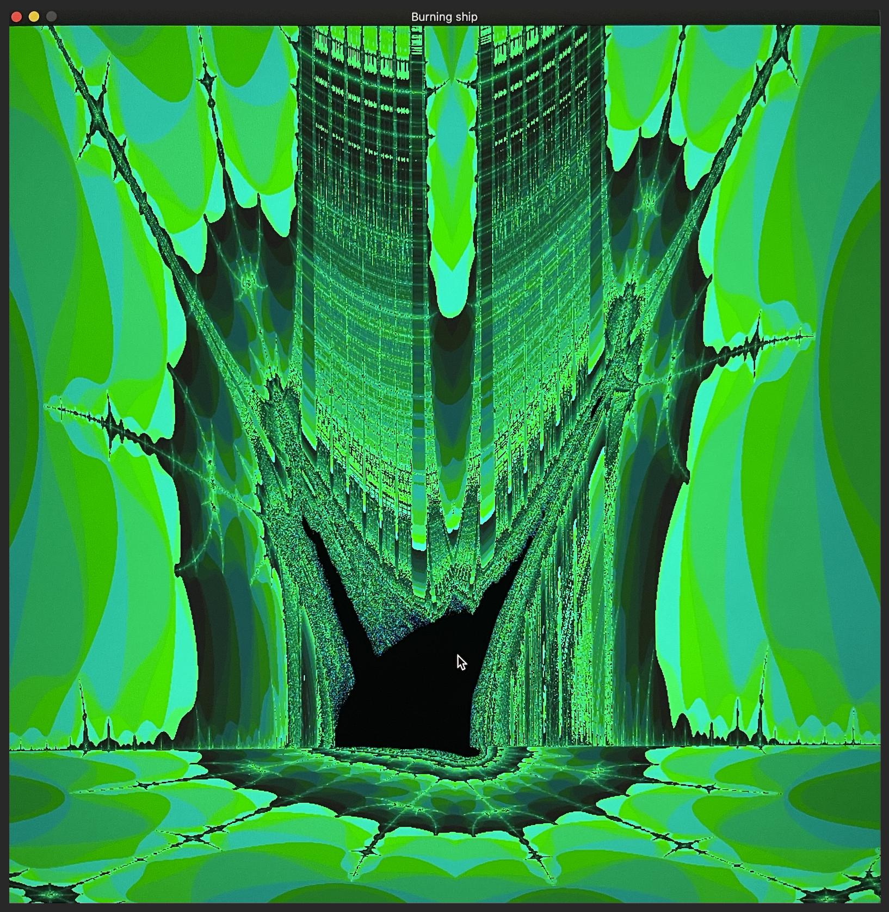

# Fract-ol

  

A fractal exploration program written in C that visualizes different types of fractals.

## Overview

Fract-ol is a graphical program that renders beautiful mathematical fractals. This project explores the fascinating world of complex numbers and iterative mathematical functions, providing an interactive way to visualize and explore various fractal types.

## Features

- Multiple fractal types:
  - Mandelbrot set
  - Julia set
  - Burning Ship
- Interactive controls:
  - Mouse wheel: Zoom in/out
  - Zoom method: Follow mouse-pointer
  - Left click + drag: Move around
  - SPACE key: Cycle through color schemes
  - R key: Reset boundaries to initial view (zoom, extent, and resolution)
  - +/- keys: Increase/decrease resolution/ detail
  - Movements:
      - Arrow keys: Move view-extent
      - W, A, S, D: Move image within window
  - ESC: Exit program
- Adjustable iteration depth for detail resolution (comes with computational heft with increasing resolution; performance will depend on the system)

## Screenshots

### Burning Ship Fractal
<div align="center">
  
  <p><em>The Burning Ship fractal with custom coloring</em></p>
</div>

## Installation

```bash
# Clone the repository
git clone https://github.com/nuz8/Fract-ol.git

# Navigate to the project directory
cd fract-ol

# Compile the program
make

# Run with a specified fractal
./fractol mandelbrot